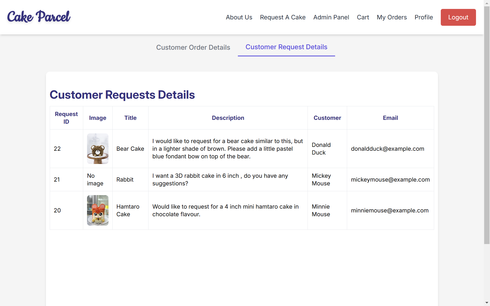

# Cake Parcel


## Background Info

Cake Parcel is an online cake delivery platform that enables users to easily place cake orders for any occasion, with options for customization to suit their celebration needs. Built using the PERN stack (PostgreSQL, Express.js, React, Node.js), this application provides a seamless and intuitive experience for browsing, ordering, and personalizing cakes for birthdays, weddings, and other special events.

The link to the backend repository can be found here: [Cake-Parcel-Backend](https://github.com/eeexuanlyx/Cake-Parcel-backend)

## Table of Contents

- [Screenshots](#screenshots)
- [Technologies Used](#technologies-used)
- [ERD & Planning Materials](#erd--planning-materials)
- [Getting Started](#getting-started)
- [Running The Application](#running-the-application)
- [Future Enhancements](#future-enhancements)
- [Attributions](#attributions)

## Screenshots

### Home Page - Search Products


The homepage features product cards, showcasing a variety of cakes, with a user-friendly search bar that allows users to easily find cakes by name or description. Additionally, users can filter products by cake type for more specific results. Each product card provides options to select the size and flavor of the cake, making it easy for users to customize their order before adding it to the cart.

### Profile Page


Users can update their account settings(email, password) and their address/contact in their profile page.

### Requests Page


On the Requests page, users can submit a customization form to provide detailed descriptions of how they would like their cake to be made. Users may also upload a reference image to better convey their ideas, ensuring their order is tailored to their preferences.

### Cart Page


On the Cart page, users have the flexibility to modify their selections, including adjusting the cake flavor and quantity. They can also choose a preferred delivery date and time slot to suit their schedule. If users haven't yet made up their mind, they can leave the items in the cart, as their progress will be saved for later.

Once all changes are made, users can proceed to checkout, which will lead to the Stripe checkout:

### Checkout Page


### My Orders Page


Once payment is succesful, it will be added to the user's My Orders Page.

### **Admin Panel**

**Customer Orders Tab**

Admins have full control over the application, allowing them to manage user orders and update their status. This ensures users are kept informed about the progress of their orders, from pending to delivered.

**Customer Requests Tab**

Additionally, admins can view and review customization requests submitted by users through the order forms, and they can follow up with users directly using the contact information provided.

## Features

- **Landing Page**: Showcase featured designs.
- **Search and Filters**: Search for products by name/description or sort by product type.
- **Product Cards**: View product image and description, selection of size and flavour to add to cart
- **Cart Mangement** : Review or update cart items such as quantity and flavour. Choose delivery date and preferred time slot.
- **My Orders Page**: Keep track of orders placed and check updated status of the order.
- **Request Customization**: Form to submit requests/enquires.
- **Admin Panel** : Order tracking, customer service, and administrative operations.
- **Responsive Design**: Enjoy a seamless experience across all devices, from smartphones to desktops.

## Technologies Used

**Frontend**

- **React**: Front-end JavaScript library for building user interfaces.
- **Vite**: Development environment and bundler.
- **React Router**: Declarative routing for React applications.
- **TanStack Query**: For efficient data fetching, caching and state management.
- **Axios**: Promise-based HTTP client for API requests.
- **Tailwind CSS**: Utility-first CSS framework for styling.

**Backend**

- **Node.js**: JavaScript runtime environment for server-side development.
- **Express.js**: Web application framework for Node.js.
- **PostgreSQL**: Open source object-relational database system that uses and extends the SQL language
- **jsonwebtoken** : Library for creating and verifying JSON Web Tokens (JWTs) for authentication.
- **Stripe** : Payment processing service to handle secure transactions.
- **Cloudinary**: Cloud service used for managing and delivering images (e.g., cake reference images)

## ERD & Planning Materials


In this database schema, the relationships between entities are structured to efficiently manage user orders, cart items, and customer requests:

- Each user has a one-to-one relationship with a cart, which is transferred to invoices and invoice_products upon checkout.

- An invoice can include multiple products, creating a one-to-many relationship with the invoice_products table.

- Order details are consolidated by joining users, user_data, invoices, invoice_products, and products, enabling admins to review transactions in the admin panel.

- Customer inquiries are managed via the user_requests table, linked to users, for streamlined follow-ups.

This design supports seamless order tracking, customer service, and administrative operations.

User Stories and Stretch Goals : [Trello board](https://trello.com/b/JFUwpyKt/cake-parcel)

## Getting Started

To get started with this project, follow these steps:

### Prerequisites

1. Ensure [Node.js](https://nodejs.org/en) and [PostgreSQL](https://www.postgresql.org/) are installed.
2. Sign up for an account on [Cloudinary](https://cloudinary.com/) and [Stripe](https://stripe.com/) to get your API keys.

### To Run Locally

#### Frontend (Cake-Parcel-Frontend)

1. Open terminal and clone the repository:

   ```bash
   git clone https://github.com/eeexuanlyx/Cake-Parcel-Frontend.git
   ```

2. Navigate to the project directory:

   ```bash
   cd Cake-Parcel-Frontend
   ```

3. Install the client dependencies:

   ```bash
   npm i
   ```

4. Create a `.env` file in the project directory and add the following variable:

   ```
   VITE_EXPRESS_BACKEND_URL=http://localhost:5001
   ```

#### Backend (Cake-Parcel-Backend)

1. In another directory, open terminal and clone the repository:

   ```bash
   git clone https://github.com/eeexuanlyx/Cake-Parcel-Backend.git
   ```

2. Navigate to the project directory:

   ```bash
   cd Cake-Parcel-Backend
   ```

3. Install the server dependencies:

   ```bash
   npm i
   ```

4. Create a `.env` file in the project directory and add the following variables:

   ```
   PORT=5001

   DB_USER=<username> # Replace with your database username
   DB_PASSWORD=<password> # Replace with your database password
   DB_HOST=localhost
   DB_PORT=5432
   DB_NAME=<DB_NAME> # Replace with your database name

   JWT_SECRET=<secret-key>  # Replace with a secret generated from a random key generator

   CLOUDINARY_URL=<url>
   API_SECRET=<secret>
   API_KEY=<key>
   CLOUD_NAME=<name>
   # Replace <url>, <secret>, <key>,<name> respectively with your Cloudinary API keys

   STRIPE_PRIVATE_KEY=<key> # Replace with your Stripe secret key

   CLIENT_URL=http://localhost:5173
   ```

## Running The Application

1. **Start the server**

   Run `nodemon` within the `Cake-Parcel-Backend` directory.

1. **Start the client**

   Run `npm run dev` within the `Cake-Parcel-Frontend` directory.

1. **Create the database**

   Create a database in PostgresSql using psql terminal or pgAdmin4.

   Follow the documents in `database.sql` to create the tables in the database. (you may replace the DATABASE name)

1. **Seed the products**

   To initialize the `products` into the database, send a `POST` request using [Postman](https://www.postman.com/) to `http://localhost:5001/products/seed`.

## Future Enhancements

1. **Multiple Delivery Addresses**: Allow users to save multiple addresses for convenient gifting and deliveries to different locations.

2. **Sharable Product Links**: Add a "Share" button for users to share products easily via social media or messaging platforms.

3. **Custom Comments/Notes**: Enable users to include personalized notes or instructions with their orders to cater to specific preferences.

## Attributions

### Resources

- Cake Products data from [eeexuanbakes](https://www.instagram.com/eeexuanbakes/)
- Fonts from [Google Fonts](https://fonts.google.com/)
- Image Slider from [Swiper](https://swiperjs.com/react)
- Image Upload with [Cloudinary](https://cloudinary.com/)
- Payment Checkout with [Stripe](https://stripe.com/)

### Project Planning Materials

- ERD : [drawio](https://www.drawio.com/)
- Layout and Wireframe : [Figma](https://www.figma.com/)
- Planning Board : [Trello](https://trello.com/)

### References

- [PostgreSQL Documentation](https://www.postgresql.org/docs/)
- [Tailwind CSS Documentation](https://tailwindcss.com/docs)
- [TanStack Query Documentation](https://tanstack.com/query/latest/docs/framework/react/overview)
- [React Router Documentation](https://reactrouter.com/)
- [Axios Javascript Library](https://axios-http.com/docs/intro)
